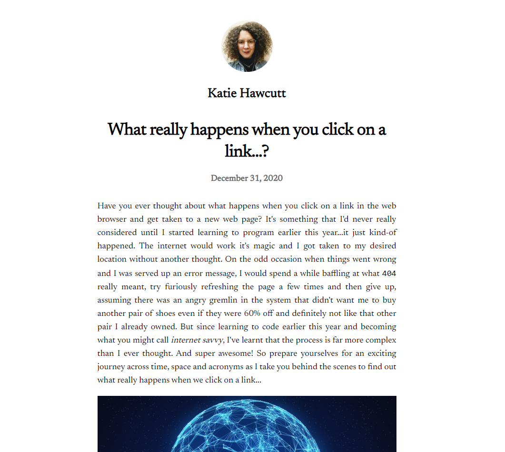

# Blog Website

## [View it here](https://my-blog-website.vercel.app/)

##### February 2021

_This is the first site I built with Next.js and it's deployed using Vercel. It's a simple blog website with a homepage and links to individual blog posts using dynamic routes._

## Main Learning Points:

- how to create a new page using the integrated file system routing
- how to us the `Link` component to enable client-side navigation between pages
- how to customize what goes inside the `Head` for each page
- how to add static files (images, etc) to Next.js.
- how to use the `Image` component to resize and optimise images on demand
- pre-rendering: by default Next.js pre-renders every page. This means that Next.js generates HTML for each page in advance, instead of having it all done by client-side JavaScript. It can result in better performance and SEO.
- how to use `getStaticProps()` to import external blog data into the index page
- I learnt lots about `getStaticProps()`:
  - is an async function which runs at build time in production. You use it to fetch external data (from the file system, a database or an external API) and send it as props to the page.
  - only runs on the server-side. It will never run on the client-side. It won’t even be included in the JS bundle for the browser. That means you can write code such as direct database queries without them being sent to browsers.
  - can only be exported from a page. You can’t export it from non-page files.
  - if you need to fetch data at request time and cannot pre-render a page ahead of a user's request Static Generation is not a good idea. In cases like this, Server-side Rendering would be a good option. To use Server-side Rendering, you need to export `getServerSideProps()` instead of `getStaticProps()` from your page.
- how to statically generate pages with dynamic routes using `getStaticPaths()`. When each page path depends on external data Next.js allows you to statically generate pages with paths that depend on external data. This enables dynamic URLs in Next.js.
- pages that begin with `[` and end with `]` are dynamic routes in Next.js.
- how to link to a page with dynamic routes.

- how to render markdown using [remark](https://github.com/remarkjs/remark).
- how to deploy my Next.js app with Vercel. It was really quick and easy!

## Built with:

- HTML
- CSS
- JavaScript
- React
- Next.js
- Deployed with Vercel

## View it here:

https://my-blog-website.vercel.app
